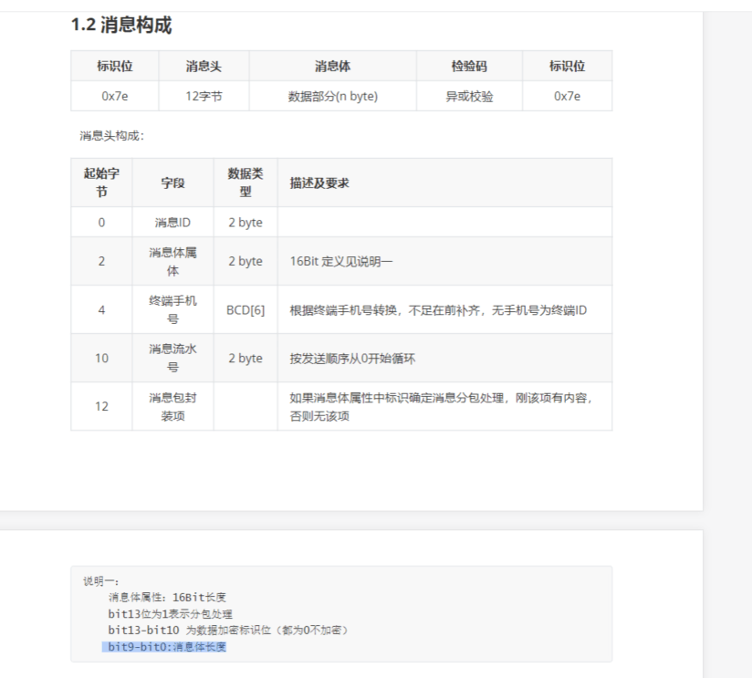

# 基础知识

jt808是二进制流传输的，服务端接收到的是个二进制流

    消息ID  0-2  2个字节
    消息体属性
    终端手机号
    消息流水号
    消息包封装项（就是消息体）

消息体长度
    
    bit9-bit0:消息体 长度

    消息体属性 2字节 对就对应 16bit

    b15  b14 b13 b12  b11 b10 b09 b08  b07 b06 b05 b04 b03 b02 b01 b00
     0    0   0   0    0   0   1   1    1   1   1   1   1   1   1   1   

    就是 0000 0011 1111 1111 对应 0x03FF

    所以 msgBodyProps & 0x03FF

