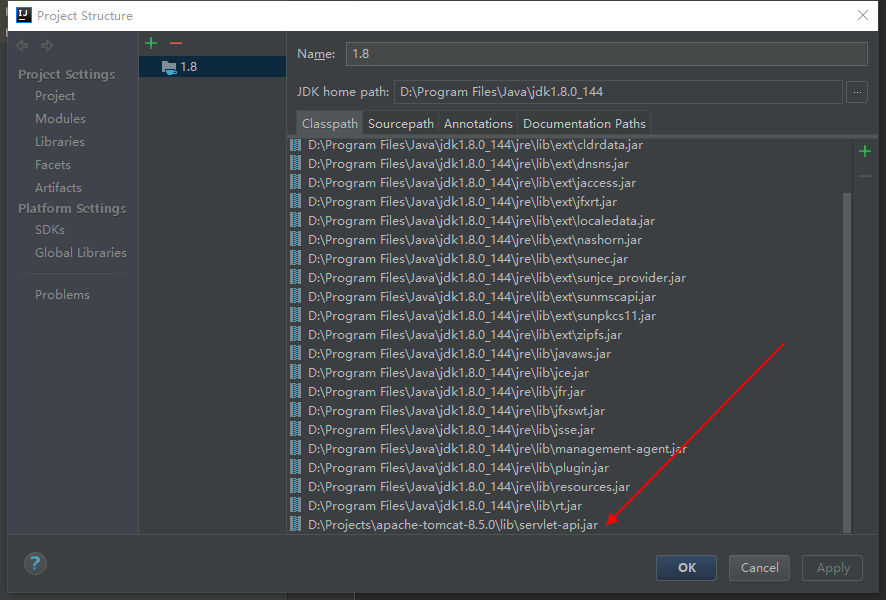
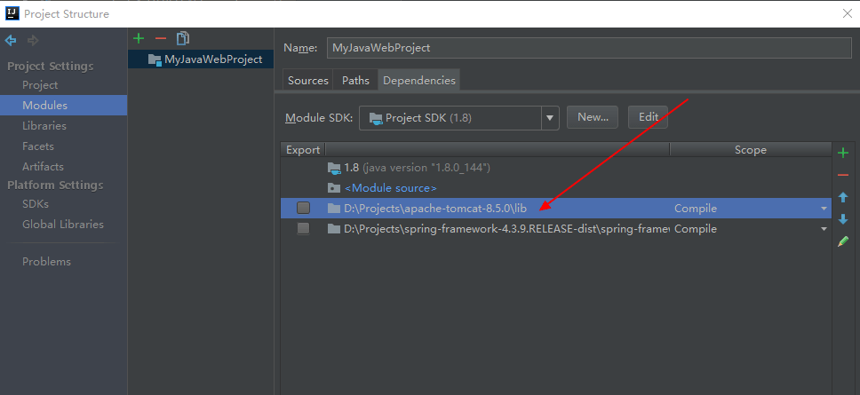
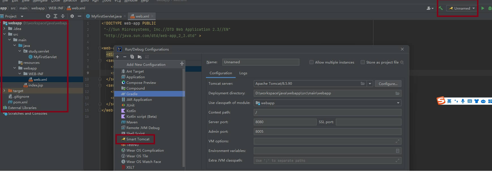

# 目录结构

src：（source）存放所有资源和代码
        main：主程序
                ○ java（源 根）：.java文件。package 包路径com.项目名称
                ○ resources（资源 根）：资源文件，如xml、properties配置文件。
                        templates：动态页面，如 thymeleaf 页面。
                                需要服务器渲染，所以直接访问是无意义的，也访问不到。
                        static：静态资源，如 html、css、js、image。
                                □ 可直接 localhost:8080/hello.html 访问该目录文件。
                                □ 也可 return "hello.html"; 跳转。
                        编译后，resources和源根在同一目录下！
                ○ lib：存放 jar包，需要设置添加到库。
                ○ webapp：web资源
                        页面静态资源：html、css、js、图片 
                        WEB-INF：固定写法。此目录下的文件不能被外部(浏览器)直接访问。
                                lib：jar包存放的目录
                                web.xml：web 项目的配置文件(3.0规范之后可以省略)
                                classes：target中，java编译生成class文件和资源文件存放的路径。对于war项目，配置文件中的classpath就是指这里。
        test：测试程序
                java（测试 根）：.java文件。
                resources（测试资源 根）：资源文件，如xml、properties配置文件。
pom.xml：maven 配置文件。
target：存放 Maven 构建当前模块，所生成的输出文件。
        classes：这就是 classpath。
                com.**：存放编译后的 .class 文件
                资源文件：src/main/resources 的所有文件。
模块配置文件.iml

# 运行程序代码

```java
package com.study;
import javax.servlet.*;
import java.io.IOException;
import java.io.PrintWriter;
public class MyFirstServlet implements Servlet {
    public void init(ServletConfig config) throws ServletException {
        System.out.println("Init");
    }
    public void service(ServletRequest request, ServletResponse response)
            throws ServletException, IOException {
        System.out.println("From service");
        PrintWriter out = response.getWriter();
        out.println("Hello, Java Web.");
    }
    public void destroy() {
        System.out.println("Destroy");
    }
    public String getServletInfo() {
        return null;
    }
    public ServletConfig getServletConfig() {
        return null;
    }
}
```
javax.servlet 这个包找不到。前面提的过 Servlet API 是包含在 JavaEE 当中的。
为了方便，我们直接使用 Tomcat 附带的 servlet-api.jar 包。
下载 tomcat 就有
idea 具体操作如下图
方法一


方法二



# 运行程序
idea 调试
idea 配置tomcat 直接点击运行就可以了
idea 配置tomcat如下



服务器部署。

tomcat 目录下的webapps 目录创建项目目录
示例如下：
    webapps
      - MyFirstServlet
        - WEB-INF
          - web.xml

<font color="red">将 IDEA 编译出的产物（默认应该在 out/target 文件夹中）</font>，
把 package 结构已经对应的产物拷贝到 WEB-INF 中的 classes 文件
webapps
  - MyFirstServlet
    - WEB-INF
      - classes
        - com
          - skyline
            - MyFirstServlet.class
      - web.xml


# 遇到问题

1.为啥idea 编译后 有时候在out 目录下 有时候子安target 目录下

在IDEA中，编译后生成的输出文件可以存放在不同的目录中，一般是由项目的配置文件决定的。
如果项目使用了Maven或者Gradle等构建工具，那么编译后的输出文件会存放在target目录下；
如果项目没有使用构建工具或者使用了自定义的构建配置，那么可以在IDEA中设置输出目录路径，
可能会存放在out目录下