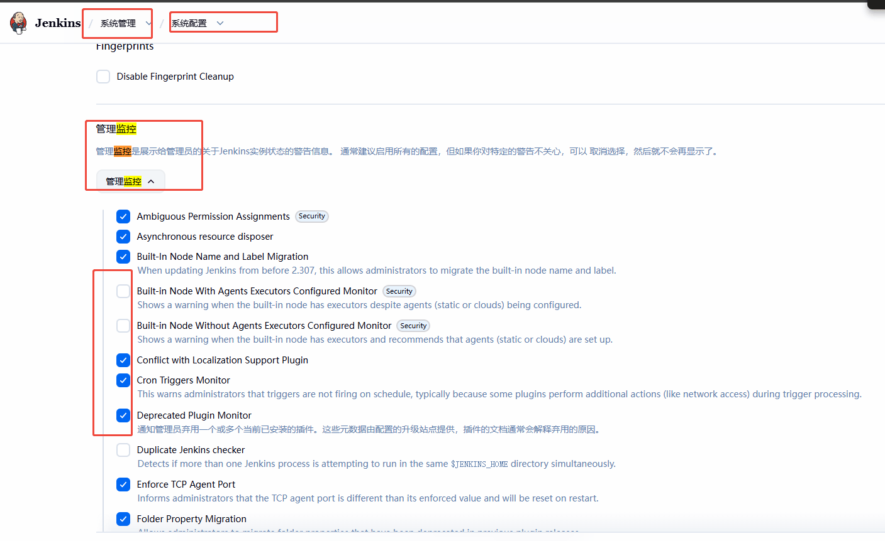
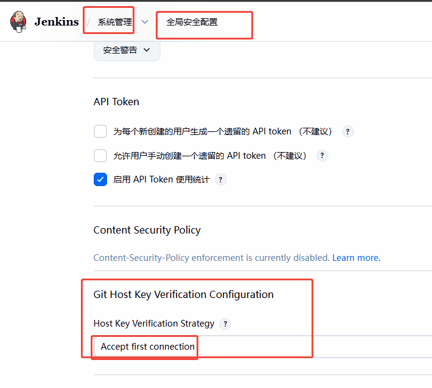

# 一、安装

## 1.1war包安装方案、

基础环境 java版本 要对应好

##  1.2docker安装

这个方式我用了 感觉 卡 慢

# 二、相关基础配置

## 2.1 关闭那些 升级通知

    Jenkins Update Notification（核心升级提示）
    Plugin Update Notification（插件升级提示）
    Hudson.model.UpdateCenter$CoreUpdateMonitor（核心更新监控）

## 2.2 配置git拉取代码

    sudo su -s /bin/bash jenkins
    
    ssh-keygen  #下面全多回车
    
    cat ~/.ssh/xxx.pub  # 放到git gitlab服务器上 配置
    
    jenkins系统配置 - 凭据配置中配置 私钥
    
    首次jenkins 服务器首次拉代码有个

### 2.2.1 方法一

### 2.2.2 方法二
直接系统上拉下代码 信任下，以后就可以了

### 2.2.3 方法三

    # 1. 切换到 jenkins 用户
    sudo -u jenkins -i
    
    # 2. 创建 .ssh 目录（如果不存在）
    mkdir -p ~/.ssh
    chmod 700 ~/.ssh
    
    # 3. 生成 SSH 密钥（全程回车，不要设密码）
    ssh-keygen -t ed25519 -C "jenkins@cxszh" -f ~/.ssh/id_ed25519 -N ""
    
    # 4. 自动把 git.utooo.com 的主机密钥写入 known_hosts
    ssh-keyscan -p 9068 git.utooo.com >> ~/.ssh/known_hosts
    
    # 5. 修正 known_hosts 权限（SSH 硬性要求）
    chmod 600 ~/.ssh/known_hosts

## 2.3安装插件

1.Publish Over SSH 【用于ssh 登录上传代码到服务器】

