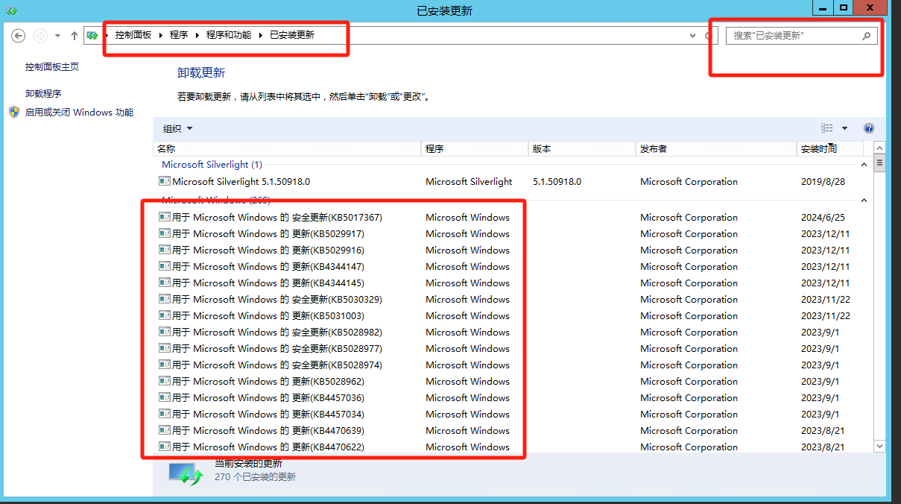
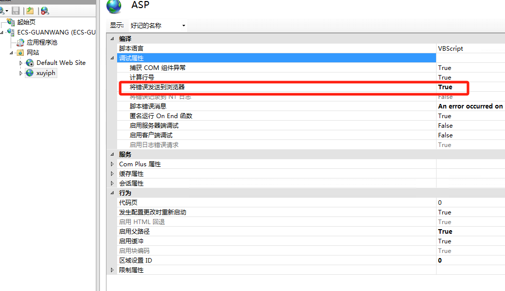
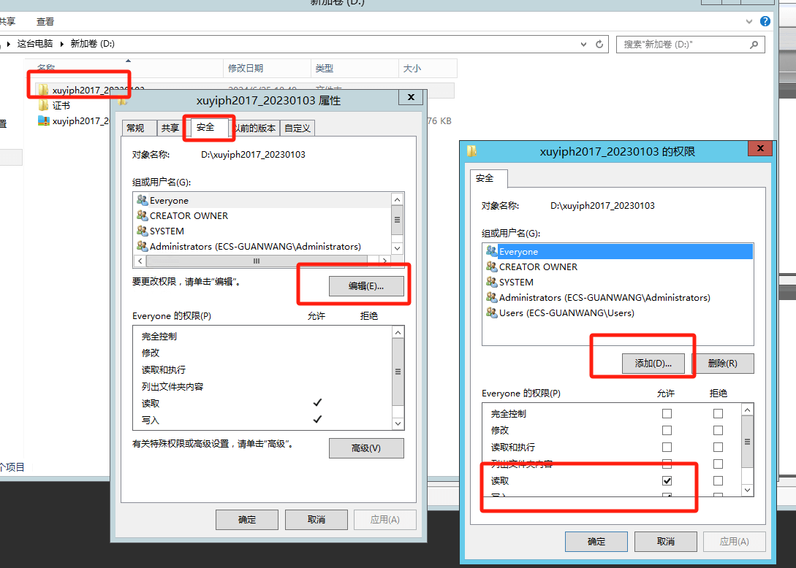
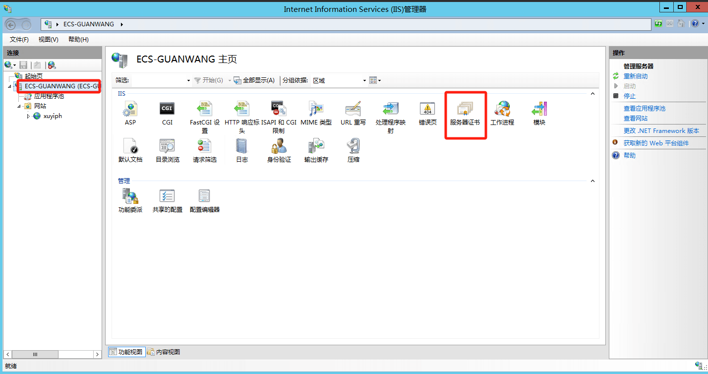
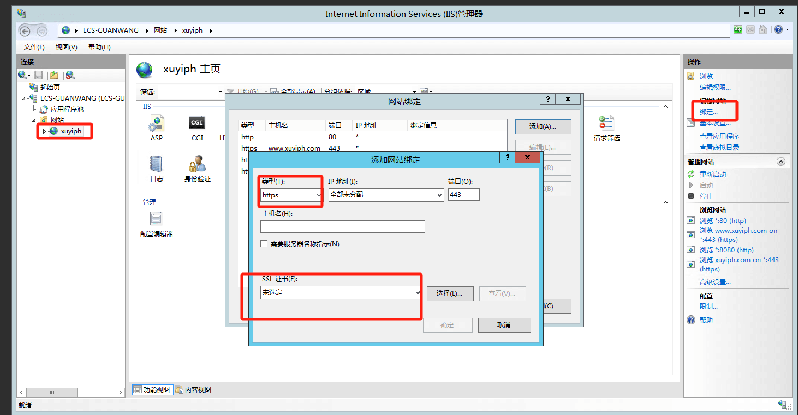
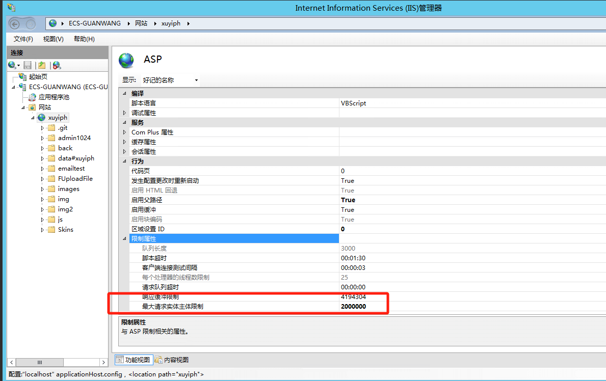
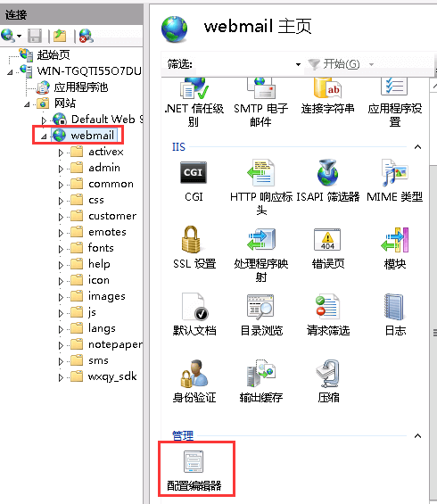
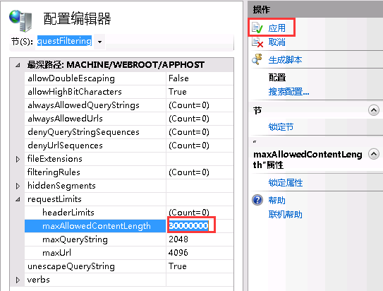

# 一 、安装asp.net 3.5 总是失败

卸载相关补丁KB5027141  KB5028872  KB5028970  KB5029915

# 二、 应用程序池

    设置为 集成  2.0 的版本【安装.net 3.5 后 这边就是只有2.0的选项哦】

# 三、总是显示500，开启报错 方便调试

双击ASP 设置

    将错误发送到浏览器  true
    
  
    
# 四、设置文件夹权限

 everyone  读写就可以了
 
      
 
 
# 五、Win2012  Microsoft JET Database Engine 错误 '80004005' 

    access 数据库没有权限访问
    
    设置c:/windows/temp或者%windir%/temp/
    
    erveryone  读写权限就可以了

# 六、IIS给网站配置https证书
## 6.1导入入证书

## 6.2配置证书

# 七、IIS限制上传配置
修改ASP 配置中 限制属性

网站中的配置修改(没配置项，可不配置) 
在“节”选项下找到system.webServer/security/requestFiltering节。

