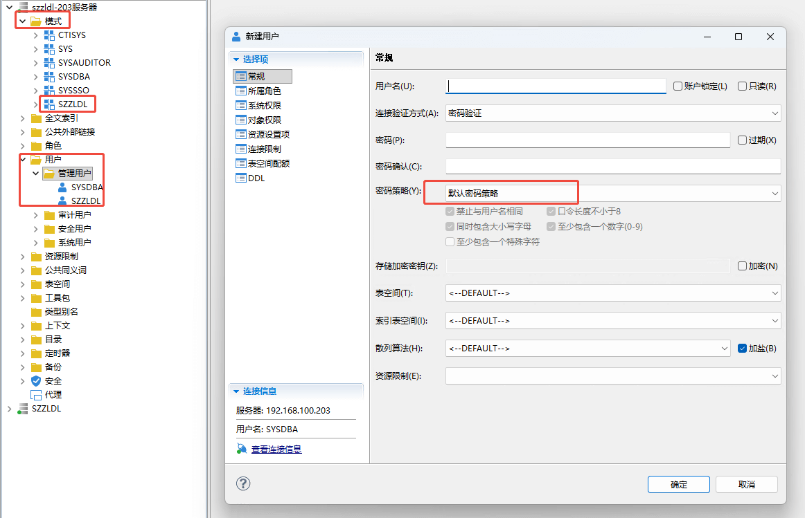
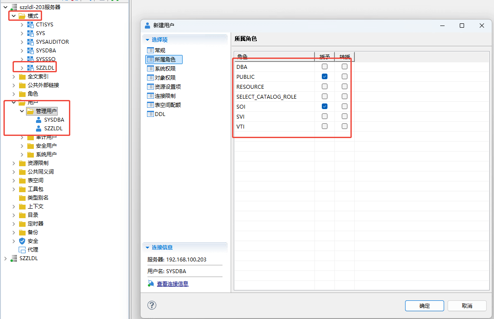

    
# 一、安装
    
    下载地址 https://eco.dameng.com/download/

    安装操作文档 https://eco.dameng.com/document/dm/zh-cn/start/dm-service-registered-linux.html


groupadd dinstall -g 2001

useradd  -G dinstall -m -d /home/dmdba -s /bin/bash -u 2001 dmdba

passwd dmdba


使用 root 用户打开 /etc/security/limits.conf 文件进行修改，命令如下：

vi /etc/security/limits.conf
在最后需要添加如下配置：

```php
dmdba  soft      nice       0
dmdba  hard      nice       0
dmdba  soft      as         unlimited
dmdba  hard      as         unlimited
dmdba  soft      fsize      unlimited
dmdba  hard      fsize      unlimited
dmdba  soft      nproc      65536
dmdba  hard      nproc      65536
dmdba  soft      nofile     65536
dmdba  hard      nofile     65536
dmdba  soft      core       unlimited
dmdba  hard      core       unlimited
dmdba  soft      data       unlimited
dmdba  hard      data       unlimited
```

##实例保存目录
mkdir -p /dmdata/data
##归档保存目录
mkdir -p /dmdata/arch
##备份保存目录
mkdir -p /dmdata/dmbak


chown -R dmdba:dinstall /dmdata/data
chown -R dmdba:dinstall /dmdata/arch
chown -R dmdba:dinstall /dmdata/dmbak

chmod -R 755 /dmdata/data
chmod -R 755 /dmdata/arch
chmod -R 755 /dmdata/dmbak

mount -o loop dm8_20240116_x86_rh7_64.iso /mnt


su - dmdba
cd /mnt
./DMInstall.bin -i 安装

# 二、创建实例

这个须在dmdba 用户下执行

CASE_SENSITIVE  y 大写  n 不限制大小写

./dminit path=/dmdata/data PAGE_SIZE=32 EXTENT_SIZE=32 CASE_SENSITIVE=n CHARSET=1 DB_NAME=szzldl INSTANCE_NAME=DBSERVER PORT_NUM=5237 SYSDBA_PWD=Utooo@520  SYSAUDITOR_PWD=Utooo@520

cd /home/dmdba/dmdbms/script/root/

./dm_service_installer.sh -t dmserver -dm_ini /dmdata/data/szzldl/dm.ini -p szzldl

cd /home/dmdba/dmdbms/bin
./DmServiceszzldl start

也可以
systemclt status DmService命令定义名称
    示例
    systemclt status DmServiceszzldl

# 创建模式、创建用户

    达梦数据库的模式就类似MySQL中的数据库的概念


| 角色 | 含义 | 应用场景 | 是否授予应用用户 |
| :--- | :--- | :--- | :--- |
| **PUBLIC** | 公共角色，所有用户自动拥有 | 基础权限，默认授予即可 | ✓ |
| **RESOURCE** | 资源角色，允许创建表、视图、索引等对象 | 需要建表、修改结构的应用 | 需要时授予 |
| **VTI** | 允许查询动态性能视图（v$开头的系统视图） | 监控、性能分析应用 | 需要时授予 |
| **DBA** | 数据库管理员角色，拥有所有权限 | 数据库管理员专用 | ✗ **绝对不要授予** |
| **SOI** | 系统操作员角色，可执行备份恢复等系统操作 | 备份管理工具 | 通常不授予 |
| **SELECT_CATALOG_ROLE** | 可查询数据字典（系统表） | 需要查看元数据的工具 | 需要时授予 |




